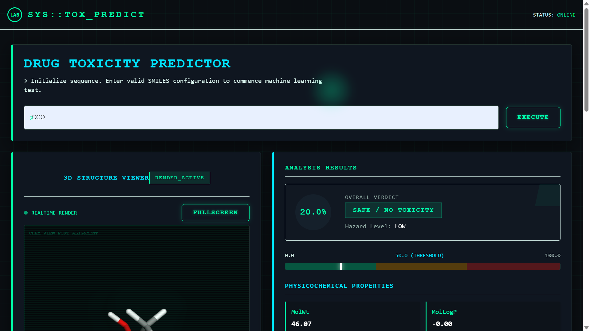
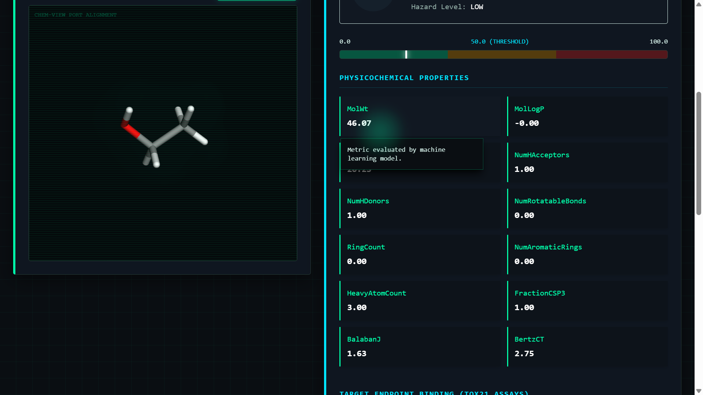
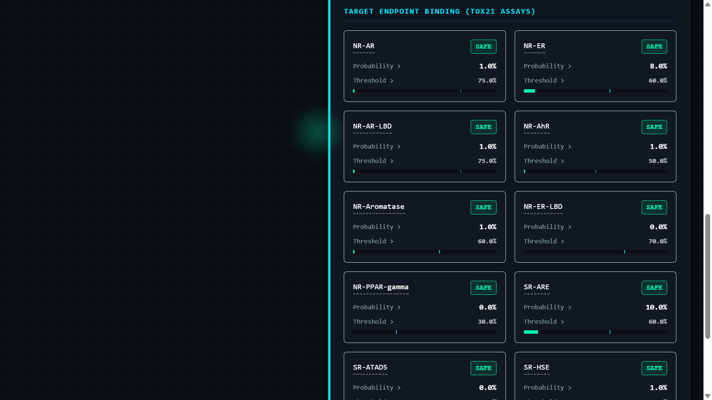

# 🔬 Drug Toxicity Detector

A machine learning-powered web application that predicts drug toxicity across 12 different biological endpoints using XGBoost models with ensemble averaging. Achieve up to 80% accuracy in predicting adverse effects of chemical compounds.

## 📊 Project Overview

Drug Toxicity Detector uses advanced machine learning to analyze chemical structures and predict their potential toxicity effects on various biological targets. The system employs an ensemble of two XGBoost models that are averaged to provide robust predictions across 12 different nuclear and stress response endpoints specified by the Tox21 challenge.

### Key Features

- ✅ **Multi-Endpoint Prediction**: Predicts toxicity for 12 different biological endpoints
- ✅ **High Accuracy**: Up to 80% accuracy with ensemble model averaging
- ✅ **Ensemble Approach**: Combines two XGBoost models for improved robustness
- ✅ **Molecular Visualization**: Interactive 3D visualization of molecular structures
- ✅ **Fast API**: RESTful API built with FastAPI for quick predictions
- ✅ **User-Friendly Interface**: Modern React-based frontend with TailwindCSS
- ✅ **SMILES Support**: Accepts standard SMILES notation for chemical structures

## 📈 Model Performance

### Model 1 - Performance Metrics

| Endpoint       | ROC-AUC | Quality |
| -------------- | ------- | ------- |
| NR-AR          | 0.7368  | OK      |
| NR-AR-LBD      | 0.8928  | Very Good |
| NR-AhR         | 0.9077  | Excellent |
| NR-Aromatase   | 0.8724  | Very Good |
| NR-ER          | 0.7360  | OK      |
| NR-ER-LBD      | 0.8441  | Good    |
| NR-PPAR-gamma  | 0.7988  | Good    |
| SR-ARE         | 0.8686  | Very Good |
| SR-ATAD5       | 0.8911  | Excellent |
| SR-HSE         | 0.8066  | Good    |
| SR-MMP         | **0.9334** | 🔥 Excellent |
| SR-p53         | 0.9012  | Excellent |

### Model 2 - Cross-Validation Performance

| Target         | CV ROC-AUC Mean | CV ROC-AUC Std |
| -------------- | --------------- | -------------- |
| NR-AR          | 0.683816        | 0.021327       |
| NR-AR-LBD      | 0.731416        | 0.118572       |
| NR-AhR         | 0.857412        | 0.025826       |
| NR-Aromatase   | 0.824416        | 0.057662       |
| NR-ER          | 0.594283        | 0.055106       |
| NR-ER-LBD      | 0.752287        | 0.062741       |
| NR-PPAR-gamma  | 0.829249        | 0.115121       |
| SR-ARE         | 0.715423        | 0.023530       |
| SR-ATAD5       | 0.671591        | 0.123325       |
| SR-HSE         | 0.630419        | 0.069702       |
| SR-MMP         | 0.898916        | 0.027824       |
| SR-p53         | 0.848296        | 0.095018       |

**Ensemble Approach**: The final predictions are generated by averaging the outputs of both models, resulting in improved reliability and generalization.

## 📸 Screenshots

### Application Interface







## 🏗️ Architecture

### Backend
- **Framework**: FastAPI
- **ML Libraries**: XGBoost, scikit-learn, RDKit
- **Server**: Uvicorn with Gunicorn
- **Database**: Model files stored in `saved_models/`
- **Port**: 8000 (default)

### Frontend
- **Framework**: React with TypeScript
- **Build Tool**: Vite
- **Styling**: TailwindCSS
- **Visualization**: 3DMol.js for 3D molecular structures
- **HTTP Client**: Axios
- **Port**: 5173 (development)

## 🚀 Quick Start

### Prerequisites
- Python 3.8+
- Node.js 16+
- pip and npm

### Backend Setup

1. Navigate to the backend directory:
```bash
cd backend
```

2. Create a virtual environment:
```bash
python -m venv venv
source venv/bin/activate  # On Windows: venv\Scripts\activate
```

3. Install dependencies:
```bash
pip install -r requirements.txt
```

4. Run the server:
```bash
uvicorn app.main:app --reload
```

The API will be available at `http://localhost:8000`

### Frontend Setup

1. Navigate to the frontend directory:
```bash
cd frontend
```

2. Install dependencies:
```bash
npm install
```

3. Start the development server:
```bash
npm run dev
```

The application will be available at `http://localhost:5173`

## 📡 API Endpoints

### GET `/predict`

Predicts toxicity for a given chemical compound.

**Parameters:**
- `smiles` (string): SMILES notation of the chemical compound

**Response:**
```json
{
  "data": {
    "NR-AR": 0.45,
    "NR-AR-LBD": 0.82,
    "NR-AhR": 0.91,
    ...
  }
}
```

**Error Response:**
```json
{
  "error": "Invalid SMILES"
}
```

**Example:**
```bash
curl "http://localhost:8000/predict?smiles=CCO"
```

## 🔧 Technology Stack

### Backend
- FastAPI - Modern Python web framework
- XGBoost - Gradient boosting machine learning
- scikit-learn - Machine learning utilities
- RDKit - Cheminformatics toolkit
- NumPy & Pandas - Data processing
- python-dotenv - Environment variables

### Frontend
- React 19 - UI library
- TypeScript - Type safety
- Vite - Fast build tool
- TailwindCSS - Utility-first CSS
- 3DMol.js - Molecular visualization
- Axios - HTTP client

## 📁 Project Structure

```
Drug_Tox/
├── backend/
│   ├── app/
│   │   ├── main.py           # FastAPI application
│   │   ├── config.py         # Configuration settings
│   │   ├── predictor.py      # Prediction logic
│   │   ├── model_loader.py   # Model loading utilities
│   ├── saved_models/         # Trained XGBoost models
│   ├── Dockerfile            # Docker configuration
│   └── requirements.txt       # Python dependencies
├── frontend/
│   ├── src/
│   │   ├── App.tsx           # Main React component
│   │   ├── component/
│   │   │   ├── Molecule.tsx          # Molecular viewer
│   │   │   ├── PredictionDetails.tsx # Results display
│   │   │   └── Loading.tsx           # Loading state
│   │   ├── index.css         # Global styles
│   │   └── main.tsx          # React entry point
│   ├── public/               # Static assets
│   ├── Dockerfile            # Docker configuration
│   ├── package.json          # Node dependencies
│   └── vite.config.ts        # Vite configuration
└── README.md
```

## 🐳 Docker Deployment

### Build and Run with Docker

**Backend:**
```bash
cd backend
docker build -t drug-tox-backend .
docker run -p 8000:8000 drug-tox-backend
```

**Frontend:**
```bash
cd frontend
docker build -t drug-tox-frontend .
docker run -p 3000:80 drug-tox-frontend
```

## 🌐 Deployment

The application is configured for deployment on cloud platforms like Render. Update the CORS origins in `backend/app/main.py` with your deployed URL.

## 📊 Understanding the Predictions

The model predicts toxicity across 12 biological endpoints:

- **NR Endpoints** (Nuclear Receptors):
  - NR-AR: Androgen Receptor
  - NR-AR-LBD: AR Ligand Binding Domain
  - NR-AhR: Aryl Hydrocarbon Receptor
  - NR-Aromatase: Aromatase enzyme
  - NR-ER: Estrogen Receptor
  - NR-ER-LBD: ER Ligand Binding Domain
  - NR-PPAR-gamma: Peroxisome Proliferator-Activated Receptor

- **SR Endpoints** (Stress Response):
  - SR-ARE: Antioxidant Responsive Element
  - SR-ATAD5: ATAD5 enzyme
  - SR-HSE: Heat Shock Element
  - SR-MMP: Mitochondrial Membrane Potential
  - SR-p53: p53 protein pathway

## 🔐 Security Considerations

- SMILES input validation is performed on the backend
- CORS is configured to allow specific origins
- Environment variables are used for sensitive configuration
- Input sanitization prevents invalid chemical structures

## 📝 License

This project is available for educational and research purposes.

## 🤝 Contributing

Contributions are welcome! Please feel free to submit pull requests or open issues for bugs and feature requests.

## 📧 Contact & Support

For questions or support, please refer to the project documentation or contact the development team.

---

**Note**: This is a demonstration project for drug toxicity prediction. Always validate results with domain experts before making pharmaceutical decisions.
